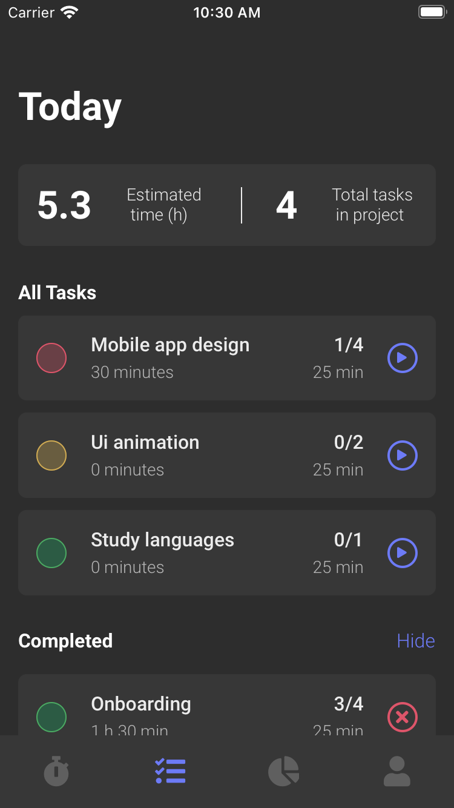
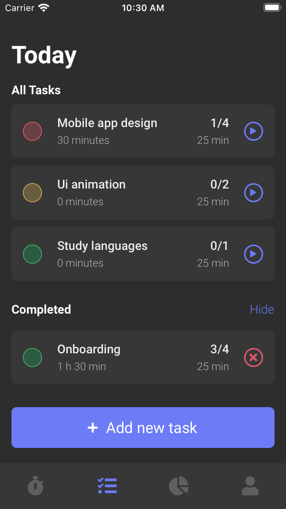
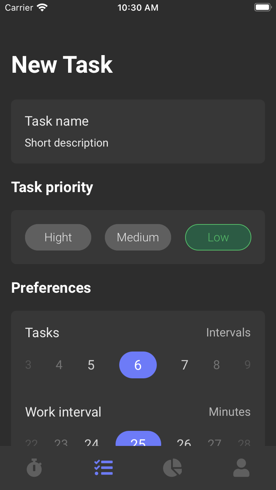
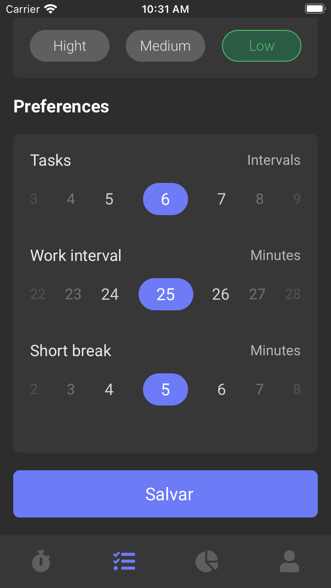
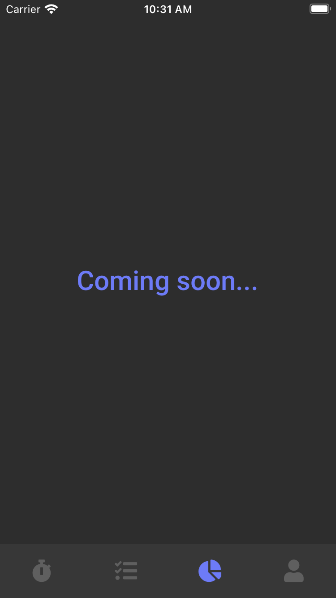

<!-- PROJECT SHIELDS -->
<!--
*** I'm using markdown "reference style" links for readability.
*** Reference links are enclosed in brackets [ ] instead of parentheses ( ).
*** See the bottom of this document for the declaration of the reference variables
*** for contributors-url, forks-url, etc. This is an optional, concise syntax you may use.
*** https://www.markdownguide.org/basic-syntax/#reference-style-links
-->
[![Contributors][contributors-shield]][contributors-url]
[![Forks][forks-shield]][forks-url]
[![Stargazers][stars-shield]][stars-url]
[![Issues][issues-shield]][issues-url]
[![MIT License][license-shield]][license-url]
[![LinkedIn][linkedin-shield]][linkedin-url]

<h1 align="center">Pomodoro App</h1>

<h2 align="center"> App para gerenciamento de tarefas utilizando o método pomodoro</h2>

<h3 align="center"> Criada com  React Native </h3>

<p align="center"> Usando o poder de um framework poderoso, que utiliza de uma única linguagem popular e moderna, o  JavaScript. <br> Produtividade e performance de forma enxuta. </p>

[Layout](https://dribbble.com/shots/11897384-Pomodoro-Timer-App/attachments/3523165?mode=media) da aplicação no  Dribble.

## Pré-requisitos

- [NodeJS](https://nodejs.org/en/)
- [Expo](https://expo.io/)

## Instalação

1. Clone o repositório
```sh
git clone https://github.com/claysllanxavier/pomodoro.git
```
2. Instale as dependências
```sh
yarn install
```
3. Rode o projeto
```sh
yarn start
```
4. Acesse **localhost:19002**, leia o QR Code no seu celular e utilize o aplicativo  Expo para rodar a versão mobile no seu smartphone. Ou com algum emulador Android/iOS para rodar no seu computador.

## Telas

<p align="center">
    
</p>
<br><br>
<p align="center">
    
</p>
<br><br>
<p align="center">
    
</p>
<br><br>
<p align="center">
    
</p>
<br><br>
<p align="center">
    
</p>
<br><br>
<p align="center">
    
</p>

## Contribuição

As contribuições são o que torna a comunidade de código aberto um lugar incrível para aprender, inspirar e criar. Quaisquer contribuições que você fizer são **muito apreciadas**.

1. Fork o Projeto
2. Crie seu Feature Branch (`git checkout -b feature/AmazingFeature`)
3. Commit suas modificações (`git commit -m 'Add some AmazingFeature'`)
4. Push para o  Branch (`git push origin feature/AmazingFeature`)
5. Abra uma Pull Request

## Licença

[MIT](https://github.com/claysllanxavier/pomodoro/blob/master/LICENSE)

## Contato

Claysllan Xavier - [Linkedin](https://www.linkedin.com/in/claysllanxavier/) - claysllan@gmail.com

<h4 align="center"> <em>&lt;/&gt;</em> by <a href="https://github.com/claysllanxavier" target="_blank">claysllanxavier</a> </h4>


<!-- MARKDOWN LINKS & IMAGES -->
<!-- https://www.markdownguide.org/basic-syntax/#reference-style-links -->
[contributors-shield]: https://img.shields.io/github/contributors/claysllanxavier/pomodoro.svg?style=flat-square
[contributors-url]: https://github.com/claysllanxavier/pomodoro/graphs/contributors
[forks-shield]: https://img.shields.io/github/forks/claysllanxavier/pomodoro.svg?style=flat-square
[forks-url]: https://github.com/claysllanxavier/pomodoro/network/members
[stars-shield]: https://img.shields.io/github/stars/claysllanxavier/pomodoro.svg?style=flat-square
[stars-url]: https://github.com/claysllanxavier/pomodoro/stargazers
[issues-shield]: https://img.shields.io/github/issues/claysllanxavier/pomodoro.svg?style=flat-square
[issues-url]: https://github.com/claysllanxavier/pomodoro/issues
[license-shield]: https://img.shields.io/github/license/claysllanxavier/pomodoro.svg?style=flat-square
[license-url]: https://github.com/claysllanxavier/pomodoro/blob/master/LICENSE.txt
[linkedin-shield]: https://img.shields.io/badge/-LinkedIn-black.svg?style=flat-square&logo=linkedin&colorB=555
[linkedin-url]: https://linkedin.com/in/claysllanxavier